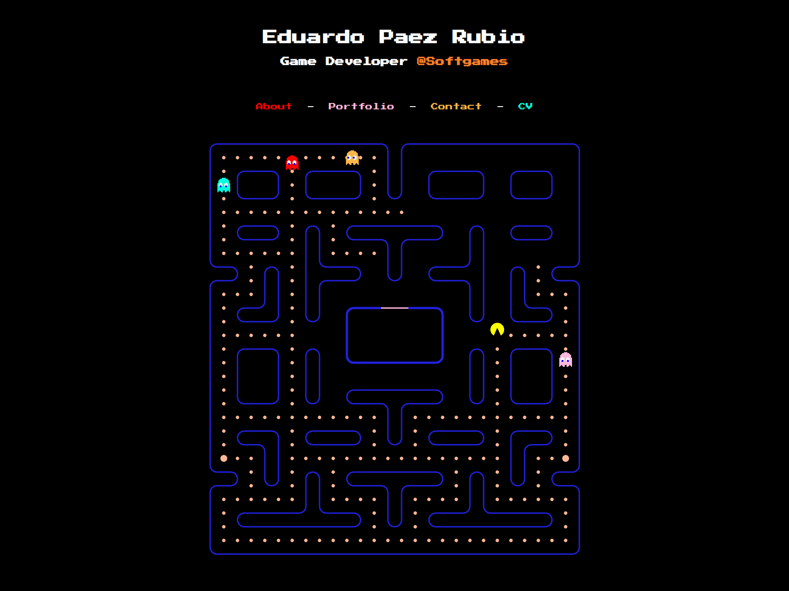

# Portfolio Pacman

This is my personal porfolio. See the live version [here](https://devpaezrubio.com).

It combines an actual playable [Pac-Man](https://en.wikipedia.org/wiki/Pac-Man) with the usual information found in a portfolio.



It's built with [pixi.js](https://github.com/pixijs/pixijs) and [@vue/reactivity](https://github.com/vuejs/core/tree/main/packages/reactivity) (not the complete Vue framework, but just the reactivity library).

## Scripts

Install dependencies

```
npm ci
```

Run development server

```
npm run dev -- --port=3000 --host=0.0.0.0
```

Compile sources

```
npm run build
```

Preview compiled sources

```
npm run preview -- --port=3000 --host=0.0.0.0
```


## License

All the code and assets in the repository are my own, and they are licensed under CC0. In other words, you can do whatever you want with them.